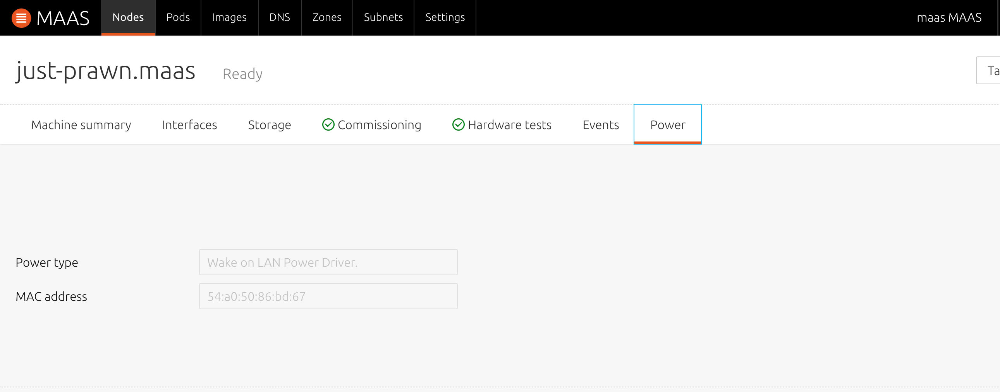

# Ubuntu MAAS 2.2 Wake on LAN Driver Patch
The WoL driver has indeed been removed from MAAS 2.0, but I need the WoL driver to test some problems, I find one way from [Using Wake on LAN with MAAS 2.x](https://stgraber.org/2017/04/02/using-wake-on-lan-with-maas-2-x/), but this way can't solve on MASS 2.2+, so I modified the some code to provider the WoL Driver.

Requirement:
* Install the wakeonlan package.
* MAAS 2.2.0+bzr6054-0ubuntu1~16.04.1 version.

Patch the WoL driver as follow:
```sh
$ sudo apt-get install -y wakeonlan
$ PATCH_DIR="/usr/lib/python3/dist-packages/provisioningserver/"
$ sudo patch -p1 -d ${PATCH_DIR} < maas-wol.diff 
$ sudo systemctl restart maas-rackd.service maas-regiond.service
```


